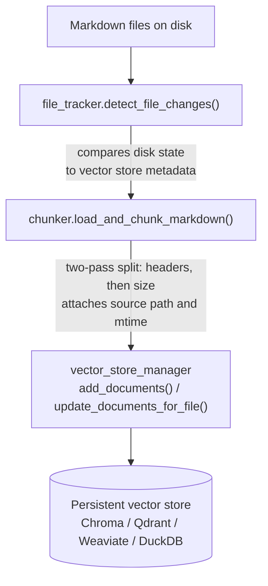
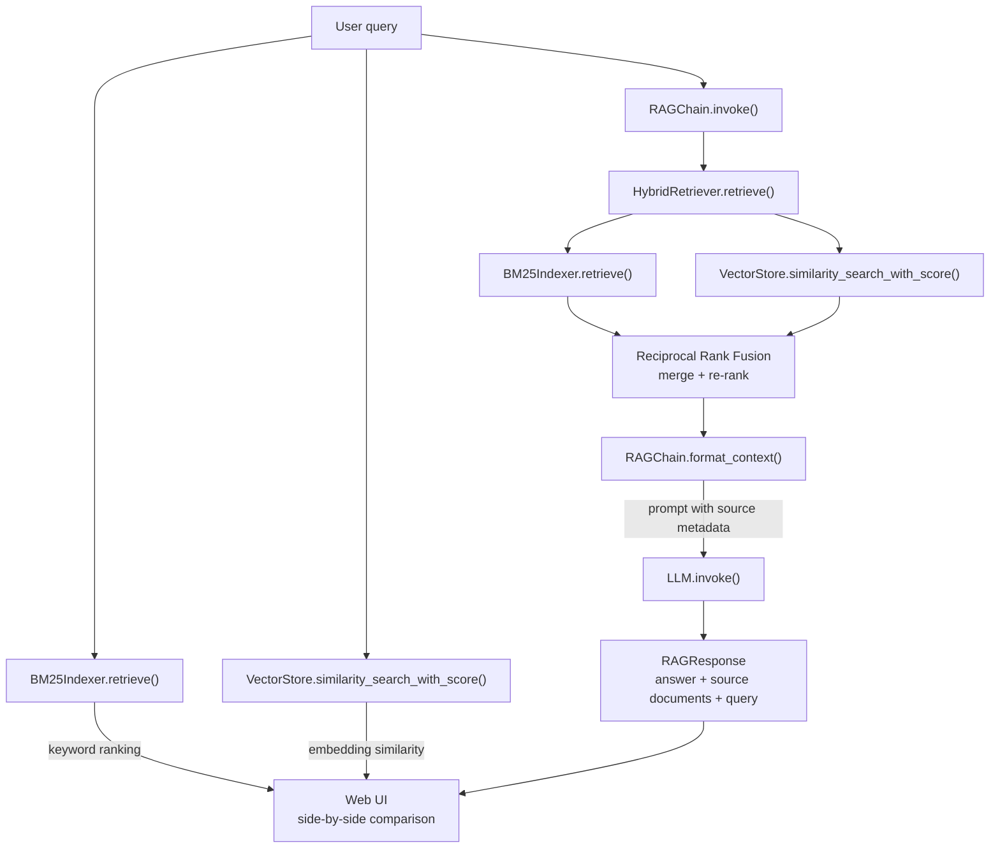

# Architecture

Epistemon is a semantic search engine over Markdown files with keyword search,
embedding-based similarity search, and retrieval-augmented generation (RAG).
This document describes the system design, the reasoning behind key choices,
and the circumstances under which those choices should be reconsidered.


## System Overview

The system has two runtime modes and three retrieval strategies.

**Runtime modes:**

1. **Indexing** (`uv run upsert-index`) -- scans a directory of Markdown files,
   chunks them, and writes embeddings to a persistent vector store and an
   in-memory BM25 index.
2. **Serving** (`uv run web-ui`) -- starts a Shiny web UI backed by a FastAPI
   application that exposes all three search strategies side-by-side.

**Retrieval strategies:**

1. BM25 keyword search (term-frequency ranking via rank_bm25)
2. Semantic search (embedding similarity via a LangChain vector store)
3. RAG answer generation (hybrid retrieval followed by LLM completion)


## Module Structure

```
epistemon/
    config.py                  Configuration loading and validation
    cli.py                     Entry points for indexing and serving
    llm_factory.py             LLM provider selection (OpenAI, Fake)
    vector_store_factory.py    Embedding + vector store provider selection
    tracing.py                 LangFuse observability wrapper
    instrumentation.py         Timing instrumentation
    logging_config.py          Logging setup

    indexing/
        chunker.py             Markdown splitting (header-aware + size-based)
        file_tracker.py        Incremental change detection (new/modified/deleted)
        indexer.py             Orchestrates the full indexing pipeline
        bm25_indexer.py        In-memory BM25 index built from disk
        vector_store_manager.py  Tracks indexed files in the vector store

    retrieval/
        rag_chain.py           RAG orchestration, protocols, response type
        hybrid_retriever.py    Reciprocal Rank Fusion over BM25 + semantic

    web/
        app.py                 FastAPI routes and static file serving
        shiny_ui.py            Shiny reactive UI
```


## Data Flow

### Indexing Pipeline



The BM25 index is rebuilt from disk on every server startup. It reads the same
Markdown files and uses the same chunking logic, but stores tokens in memory
rather than embeddings on disk.

### Query Pipeline



All three strategies run independently in the web UI so results can be
compared side-by-side.


## Key Design Choices

### 1. Protocol-based dependency injection

Components depend on thin Python Protocol classes rather than concrete
LangChain base classes.

`RetrieverProtocol` requires a single `retrieve(query) -> list[tuple[Document, float]]`
method. `LLMProtocol` requires `invoke(input, **kwargs) -> response_with_content`.
`RAGChainProtocol` defines the public `invoke()` signature shared by both
`RAGChain` and `TracedRAGChain`.

This keeps the core retrieval and generation logic decoupled from LangChain's
class hierarchy. Any object satisfying the protocol can be substituted,
including test doubles, without importing LangChain internals.

**Reconsider when:** the project needs to participate in LangChain's Runnable
composition (LCEL pipes, streaming, async batch) or LangSmith tracing. At that
point, implementing `BaseRetriever` or using the `@chain` decorator would
provide those capabilities natively.

### 2. Custom RAGChain instead of LangChain built-in chains

RAGChain is a plain Python class (~120 lines) that orchestrates retrieve,
format, and generate as explicit method calls. It does not use LangChain's
`create_retrieval_chain`, `create_stuff_documents_chain`, LCEL, or the
`create_agent` middleware pattern.

This was a deliberate choice because:

- The hybrid retriever returns scored tuples, not LangChain's Retriever interface.
- Context formatting includes custom source metadata and optional URL construction.
- The `invoke()` signature carries domain-specific parameters (`k`, `base_url`)
  that do not map to LangChain's single-input Runnable contract.
- Testing is simple: mock the protocol, assert the output.

**Reconsider when:** the project needs streaming responses, async execution,
or built-in LangSmith observability. LangChain's Runnable infrastructure
provides these out of the box, but adopting it would require adapters for the
hybrid retriever and custom context formatter.

### 3. Reciprocal Rank Fusion for hybrid search

HybridRetriever merges BM25 and semantic results using RRF rather than raw
score normalization. RRF operates on rank positions, making it robust when
combining retrievers with incompatible scoring scales (BM25 scores are
unbounded; cosine similarity is bounded to [-1, 1]).

Weights default to 0.3 BM25 / 0.7 semantic but are configurable via
`config.yaml`.

**Reconsider when:** the retrieval corpus grows large enough that learned
fusion (e.g., a cross-encoder re-ranker) would materially improve precision,
or when the scoring scales become comparable (e.g., both retrievers return
normalized probabilities).

### 4. In-memory BM25 index rebuilt on startup

The BM25 index lives only in memory and is rebuilt from the Markdown source
files every time the server starts. There is no persistent BM25 store.

This is acceptable for the current scale (hundreds to low thousands of
documents). Startup cost is dominated by chunking I/O, not BM25 construction.

**Reconsider when:** the corpus grows to tens of thousands of documents and
startup latency becomes a problem, or when the BM25 index needs to be updated
without restarting the server. At that point, a persistent keyword index
(e.g., SQLite FTS5, Tantivy, or Elasticsearch) would be appropriate.

### 5. Factory functions for pluggable backends

`create_vector_store()` and `create_llm()` select concrete implementations
based on a string provider name in the configuration. The rest of the
codebase operates on the `VectorStore` and `LLMProtocol` abstractions.

Supported vector stores: Chroma, Weaviate, Qdrant, DuckDB, InMemory.
Supported LLMs: OpenAI (ChatOpenAI), Fake (for testing).
Supported embeddings: HuggingFace, OpenAI, Fake.

**Reconsider when:** the number of backends grows enough that a plugin or
registry pattern would reduce the factory function complexity.

### 6. Three-tier embedding strategy

Unit tests use `FakeEmbeddings` (deterministic, zero latency). Integration
tests use HuggingFace `all-MiniLM-L6-v2` (local, offline, ~50 ms/embedding).
Production uses OpenAI `text-embedding-4-small` (API-based, highest quality).

This keeps the fast test loop under a second while still allowing meaningful
semantic testing with real embeddings when needed.

**Reconsider when:** a single local model (e.g., a quantized embedding model)
becomes fast enough for both CI and production, eliminating the need for
separate tiers.

### 7. Tracing as a decorator, not a framework feature

`TracedRAGChain` wraps `RAGChain` using delegation. It adds LangFuse spans
around the retrieval and generation steps and forwards a LangChain
`CallbackHandler` to capture LLM-level metrics. The business logic classes
are unaware of tracing.

This keeps LangFuse as an optional, isolated dependency. When tracing is
disabled, `create_traced_rag_chain()` returns the plain `RAGChain` with zero
overhead.

**Reconsider when:** the project adopts LangSmith for observability (which
integrates natively with LangChain's callback system), or when tracing needs
to cover more components beyond the RAG pipeline (e.g., indexing, chunking).

### 8. Shiny for Python as the UI framework

The web UI uses Shiny for Python (reactive server-side rendering) rather than
a JavaScript SPA. Shiny handles layout, reactivity, and rendering in Python,
which keeps the project single-language and avoids a build toolchain.

**Reconsider when:** the UI needs client-side interactivity beyond what
server-side rendering can provide (e.g., real-time collaborative editing,
complex drag-and-drop), or when the team prefers a JavaScript/TypeScript
frontend.


## Roadmap Context

The current architecture implements V1 (semantic search) and V2 (two-step RAG
chain) from the project roadmap. V3 (research agent with query refinement and
relevance evaluation) would likely require moving from the current two-step
chain to an agentic loop, which is the natural point to adopt LangChain's
`create_agent` or LangGraph for multi-step reasoning with tool use.
